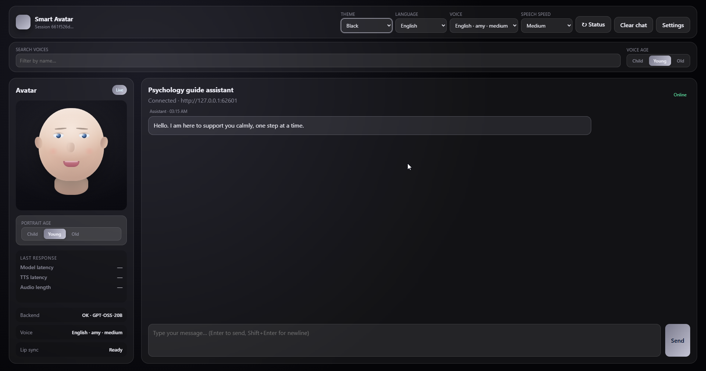
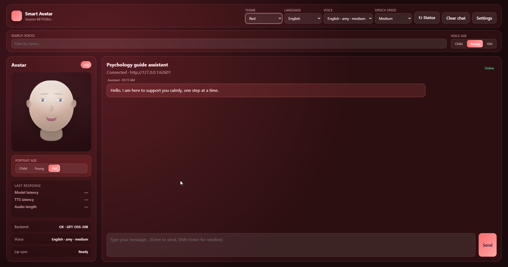
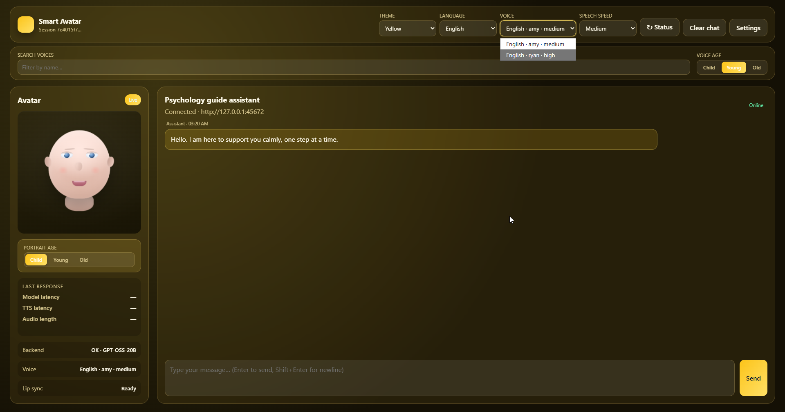
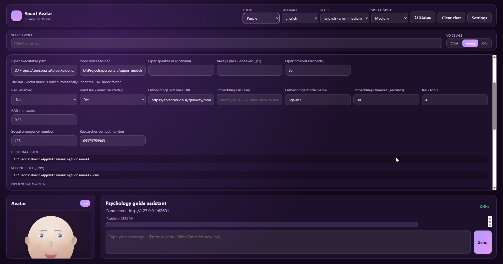

<p align="center">
  
</p>

<h1 align="center">Persona AI</h1>

<p align="center">
  <strong>Psychologist avatar</strong> — voice-first chat, OpenAI-compatible TTS/STT, Rhubarb lip-sync, and FAQ-guided replies
</p>

<p align="center">
  <a href="LICENSE"></a>
  <a href="https://www.python.org/"></a>
  <a href="https://tauri.app/"></a>
  <a href="https://fastapi.tiangolo.com/"></a>
  <a href=".github/workflows/backend.yml"></a>
  <a href=".github/workflows/desktop-linux.yml"></a>
  <a href=".github/workflows/desktop-macos.yml"></a>
</p>

<p align="center">
  <a href="#installation">Installation</a> ·
  <a href="#development">Development</a> ·
  <a href="#build">Build</a> ·
  <a href="docs/TRUST.md">Verify releases</a> ·
  <a href="CHANGELOG.md">Changelog</a>
</p>

---

## Description

**Persona AI** is an open-source research demo: a supportive psychologist-style assistant with a **3D GLB avatar**, **Rhubarb lip-sync**, and **OpenAI-compatible** chat / TTS / STT. A FastAPI backend loads a small FAQ corpus as a **high-priority conversational roadmap** (short clarifying questions), synthesizes speech, and derives mouth cues from the **audio**. The **Tauri desktop app** bundles the same stack and **starts the Python sidecar automatically** on launch. The UI opens in **voice conversation** first.

> **Disclaimer:** This is a research / demo assistant. It does not diagnose or replace professional mental-health care. Configure emergency and researcher contact numbers in `apps/backend/.env`.

**Current version:** `1.3.2`

---

## Features

- **Voice-first UI** — full-screen voice sanctuary on launch; switch to chat anytime
- **Bilingual UI** — Persian and English with locale-locked system prompts
- **OpenAI-compatible TTS / STT** — HTTP speech synthesis and transcription
- **Rhubarb lip-sync** — mouth cues from the WAV (A–H / X → GLB morphs / visemes)
- **GLB avatar** — Three.js loader with male/female models (`ui/avatars/`)
- **FAQ roadmap** — `data/faq_dataset.json` steers short, question-led replies (no vector RAG)
- **Safety layer** — high-risk detection and escalation replies
- **Desktop app** — Tauri + PyInstaller sidecar (Windows NSIS; Linux/macOS via CI)
- **Themeable UI** — themes, voice picker, and face-age controls

---

## Screenshots

<p align="center">
  
  
</p>

<p align="center">
  
  
</p>

---

## Demo video

**[Watch the demo →](https://github.com/Satan2049/persona-ai/releases/download/v0.1.0/demo.mp4)** — screen recording of chat, TTS, lip-sync, and the Windows desktop app.

---

## Installation

### Prerequisites

| Requirement | Notes |
|-------------|--------|
| **Python 3.10–3.12** | Recommended; 3.14 may break `pydantic` wheels |
| **Node.js 20+** | Desktop build only |
| **Rust** | Desktop build only |
| **LLM API** | Ollama, vLLM, GapGPT, or any OpenAI-compatible chat endpoint |
| **TTS / STT API** | OpenAI-compatible speech endpoints (often the same provider as chat) |

### Quick start (web / dev server)

```bash
git clone https://github.com/Satan2049/persona-ai.git
cd persona-ai/apps/backend
python -m venv .venv
```

**Windows:** `.venv\Scripts\activate` · **Linux/macOS:** `source .venv/bin/activate`

```bash
pip install -r requirements.txt
cp .env.example .env    # Windows: copy .env.example .env
```

Edit `apps/backend/.env` — set `MODEL_*` and optionally `TTS_*` / `STT_*`. Then from the repo root:

```text
scripts\start-backend.bat        # Windows
./scripts/start-backend.ps1      # PowerShell
```

Open **http://127.0.0.1:8000/** · Health check: **http://127.0.0.1:8000/health**

### Desktop app (release)

Download the latest installer from **[GitHub Releases](https://github.com/Satan2049/persona-ai/releases)**.

On first launch the app:

1. Starts the bundled `persona-backend` sidecar on a local port
2. Waits for `/health`, then loads the UI in **voice mode**
3. Shows setup tips if the LLM or TTS API is misconfigured

Verify downloads with [docs/TRUST.md](docs/TRUST.md).

---

## Development

```text
persona-ai/
├── apps/
│   ├── backend/          # FastAPI, TTS, STT, Rhubarb, FAQ guidance
│   └── desktop/          # Tauri + sidecar packaging
├── assets/               # Icons, screenshots, avatars source, default.env
├── data/                 # FAQ corpus
├── docs/                 # Architecture, trust, voice, data layout
├── scripts/              # Dev and release helpers
└── ui/                   # Static avatar + voice UI
```

| Task | Command |
|------|---------|
| Start API (dev) | `scripts/start-backend.bat` |
| Sync UI → desktop | `.\scripts\sync-desktop-ui.ps1` |
| Desktop dev | `npm run sidecar:build` then `npm run desktop:dev` |
| Ensure Rhubarb | `npm run rhubarb:ensure` |
| Backend docs | [apps/backend/README.md](apps/backend/README.md) |
| Desktop docs | [apps/desktop/README.md](apps/desktop/README.md) |
| Changelog | [CHANGELOG.md](CHANGELOG.md) |

**Not in git:** API keys, generated `audio/` cache, downloaded `tools/rhubarb/`.

---

## Build

### Python sidecar (PyInstaller)

**Windows:**

```powershell
npm run sidecar:build
```

**Linux / macOS:**

```bash
chmod +x scripts/build-sidecar.sh
./scripts/build-sidecar.sh
```

### Desktop installer (Tauri)

```powershell
npm install
.\scripts\sync-desktop-ui.ps1
npm run sidecar:build
npm run desktop:build
```

- Windows: `apps/desktop/src-tauri/target/release/bundle/nsis/`
- Linux / macOS: see GitHub Actions workflows under `.github/workflows/`

### Release checksums

```powershell
.\scripts\generate-sha256.ps1 -ReleaseDir "dist\release"
```

---

## Tech stack

| Layer | Technology |
|-------|------------|
| Frontend | HTML, CSS, vanilla JavaScript (`ui/`) |
| Avatar | Three.js + GLB morph targets |
| API | FastAPI + Uvicorn |
| Style context | FAQ JSON roadmap (static prompt injection) |
| TTS / STT | OpenAI-compatible HTTP |
| Lip sync | [Rhubarb Lip Sync](https://github.com/DanielSWolf/rhubarb-lip-sync) |
| LLM | OpenAI-compatible HTTP |
| Desktop | Tauri 2 + PyInstaller sidecar |

---

## Documentation

- [docs/architecture/overview.md](docs/architecture/overview.md) — system overview
- [docs/voice-conversation.md](docs/voice-conversation.md) — voice-first flow
- [docs/desktop-data-layout.md](docs/desktop-data-layout.md) — install / AppData layout
- [docs/TRUST.md](docs/TRUST.md) — verify release hashes
- [assets/avatars/README.md](assets/avatars/README.md) — replace avatars

---

## License

MIT — see [LICENSE](LICENSE).
